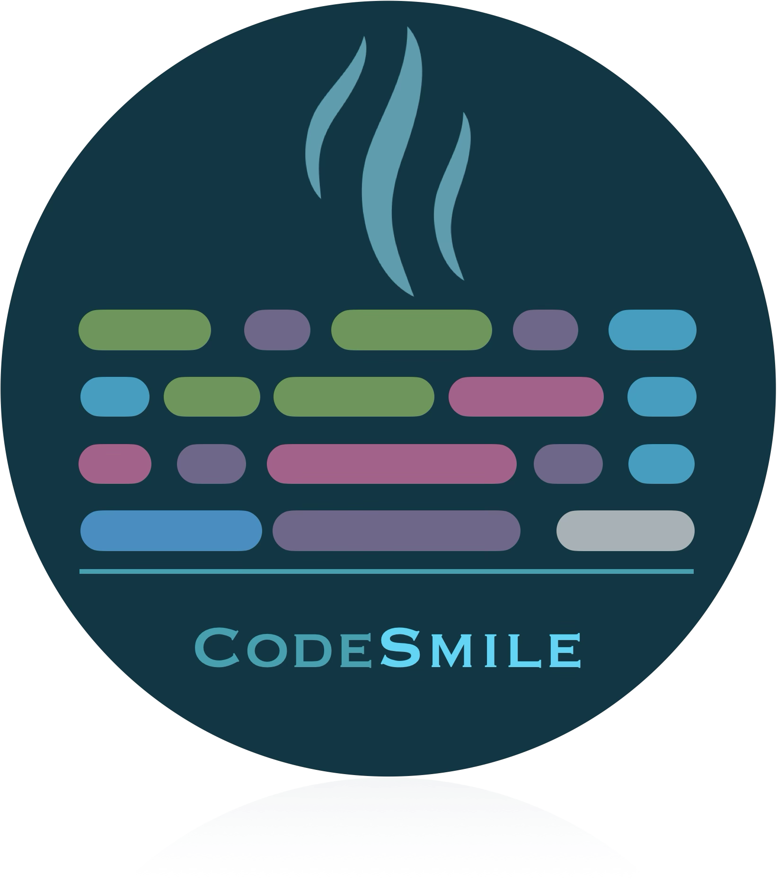

<p align="center">
  
</p>

# CodeSmile: Machine Learning-Specific Code Smell Detection Tool


CodeSmile is a suite of tools designed to detect **machine learning-specific code smells** in Python projects. It identifies suboptimal implementation patterns that impact the quality, maintainability, and performance of ML code. The suite includes:

1. **Static Analysis Tool**: Uses **Abstract Syntax Tree (AST)** parsing for rule-based detection of ML-specific code smells.
2. **AI-Based Tool**: Leverages **LLMs** to detect code smells using a trained model.
3. **Web Application**: Provides an interactive web-based interface to run both tools.

- Detects 12 machine learning-specific code smells, aiding in the identification of potential problems and areas for improvement.


This tool is designed to aid developers and researchers in improving the quality of ML codebases.


To install CodeSmile, clone the repository and execute the analyzer.py in controller folder.


## Prerequisites
- Python 3.11 is required.
- Install the required packages by running:
```bash
pip install -r requirements.txt
```

---


## 1. Static Analysis Tool

The static analysis tool detects **ML-specific code smells** through rule-based AST analysis.

### Features
- **Static Code Analysis**: Identifies ML-specific code smells.
- **Execution Modes**: Supports **CLI** for batch processing and an **interactive GUI**.
- **Code Quality Insights**: Generates detailed reports on identified code smells, including location and remediation hints.

### Code Smells Detected

#### Generic Code Smells

| **Name**                                | **Description**                                                            |
| --------------------------------------- | -------------------------------------------------------------------------- |
| Broadcasting Feature Not Used           | Tensor operations that fail to utilize TensorFlow's broadcasting feature.  |
| Columns and DataType Not Explicitly Set | DataFrames created without explicitly setting column names and data types. |
| Deterministic Algorithm Option Not Used | This smell occurs when the option `torch.use_deterministic_algorithms(True)` is not removed.|
| Empty Column Misinitialization          | Initializing DataFrame columns with zeros or empty strings.                |
| Hyperparameters Not Explicitly Set      | Missing explicit hyperparameter definitions for ML models.                 |
| In-Place APIs Misused                   | Assuming Pandas methods modify DataFrames in-place without reassignment.   |
| Memory Not Freed                        | Failing to free memory for ML models declared in loops.                    |
| Merge API Parameter Not Explicitly Set  | Missing explicit `how` and `on` parameters in Pandas merge operations.     |
| NaN Equivalence Comparison Misused      | Incorrect comparison of values with `np.nan`.                              |
| Unnecessary Iteration                   | Using explicit loops instead of Pandas vectorized operations.              |

#### AI-Specific Code Smells

| **Name**                                | **Description**                                                                       |
| --------------------------------------- | ------------------------------------------------------------------------------------- |
| Chain Indexing                          | Inefficient use of chained indexing in Pandas DataFrames (`df["col"][0]`).            |
| DataFrame Conversion API Misused        | Using `.values()` to convert Pandas DataFrames instead of `.to_numpy()`.              |
| Gradients Not Cleared                   | Missing `optimizer.zero_grad()` before backward propagation in PyTorch.               |
| Matrix Multiplication API Misused       | Misusing NumPy’s `np.dot()` for matrix multiplication.                                |
| PyTorch Call Method Misused             | Direct use of `self.net.forward()` instead of calling `self.net()` in PyTorch.        |
| TensorArray Not Used                    | Using `tf.constant()` inefficiently in loops instead of `tf.TensorArray()`.           |


### Usage

#### CLI
```bash
python -m cli.cli_runner --input <input_directory> --output <output_directory> [OPTIONS]
```

##### CLI Options:
- --input: Path to the input folder containing Python files. (Required)
- --output: Path to the output folder where the analysis results will be saved. (Required)
- --parallel: Enable parallel execution for faster analysis.
- --max_walkers: Number of workers to use for parallel execution (default: 5). Only applicable if --parallel is enabled.
- --resume: Resume a previous analysis from where it stopped.
- --multiple: Analyze multiple projects within the input folder.

#### GUI
```bash
python -m gui.gui_runner
```

### Testing
The project includes a comprehensive suite of tests to ensure code quality and reliability. Specifically, the following types of tests have been implemented:

- **Unit Tests:** Verify the functionality of individual functions and components.
- **Integration Tests:** Check the interactions between various modules.
- **System Tests:** Validate the overall behavior of the application.

All tests are located in the test directory. 

---

## 2. AI-Based Detection Tool

The AI-based tool is an experimental feasibility study that investigates the use of **LLMs** for generating synthetic datasets and detecting ML-specific code smells.

### Current Capabilities
- **Single-label classification** of ML-specific code smells.
- **Limited to detection**, without localization in code or suggested fixes due to hardware constraints.
- **Performance Metrics:** 
  - _Accuracy_: 94.46%
  - _Average Precision, Recall and F1-score_: 95%

### Dataset Generation
To create the training dataset, we injected code smells into clean functions using **Qwen 2.5 Coder 14B** (via **Ollama**). The model used for detection was fine-tuned via **LoRA** on **Qwen 2.5 Coder 3B**.

### Running the Fine-Tuned Model

#### Using `unsloth`
1. **Download the LoRA model directory** from **[this link](https://drive.google.com/drive/folders/1cEGbqr2qz019O8cifl9AfrjkI28H9y2c?usp=sharing)**.
2. Extract the contents and use them with `unsloth`:
```python
# Model configuration
max_seq_length = 2048
dtype = None  # Auto-detection
load_in_4bit = True  # 4-bit quantization

# Load pretrained model and tokenizer
model, tokenizer = FastLanguageModel.from_pretrained(
    model_name="finetuning/outputs/synthetic",
    max_seq_length=max_seq_length,
    dtype=dtype,
    load_in_4bit=load_in_4bit,
)
FastLanguageModel.for_inference(model)

inputs = tokenizer.apply_chat_template(
    user_message,
    tokenize=True,
    add_generation_prompt=True,
    return_tensors="pt",
).to(device)

outputs = model.generate(
    input_ids=inputs,
    max_new_tokens=128,
    use_cache=True,
    temperature=1.5,
    min_p=0.1,
)
tokenizer.batch_decode(outputs, skip_special_tokens=True)
```
> **Note**: This step works only on **Linux**.

#### Using `Ollama`
1. **Download the `.gguf` model file and `Modelfile`** from **[this link](https://drive.google.com/drive/folders/1-ym-jXBu1QHRUXmsb3Hvxd_nDYun91sm?usp=sharing)**.
2. Open `Modelfile` and update the first line with the **absolute path** of the `.gguf` model.
3. Run:
   ```bash
   ollama create codesmile -f <Modelfile_location>
   ```
4. The model will now be available in Ollama for inference.

---

## 3. Web Application
We have also developed a **web-based application** to provide an interface for executing both tools interactively.

For detailed instructions and further information, visit: **[this link](https://github.com/xDaryamo/smell_ai/tree/main/webapp)**.

---

## Acknowledgments
This project builds on the research presented in:
**"When Code Smells Meet ML: On the Lifecycle of ML-Specific Code Smells in ML-Enabled Systems"**
- Authors: *[Gilberto Recupito](https://github.com/gilbertrec), [Giammaria Giordano](https://github.com/giammariagiordano), [Filomena Ferrucci](https://docenti.unisa.it/001775/en/home), [Dario Di Nucci](https://github.com/dardin88), [Fabio Palomba](https://github.com/fpalomba)*  
- [Read the full paper](https://arxiv.org/abs/2403.08311) and [appendix](https://figshare.com/articles/online_resource/When_Code_Smells_Meet_ML_On_the_Lifecycle_of_ML-specific_Code_Smells_in_ML-enabled_Systems_-_Appendix/25231817?file=44582128)

Improvements and development were carried out by **[Dario Mazza](https://github.com/xDaryamo)** and **[Nicolò Delogu](https://github.com/XJustUnluckyX)** as part of the *Software Engineering: Management and Evolution* and _Software Engineering for AI_ courses in the Master's Degree program in Computer Science.


